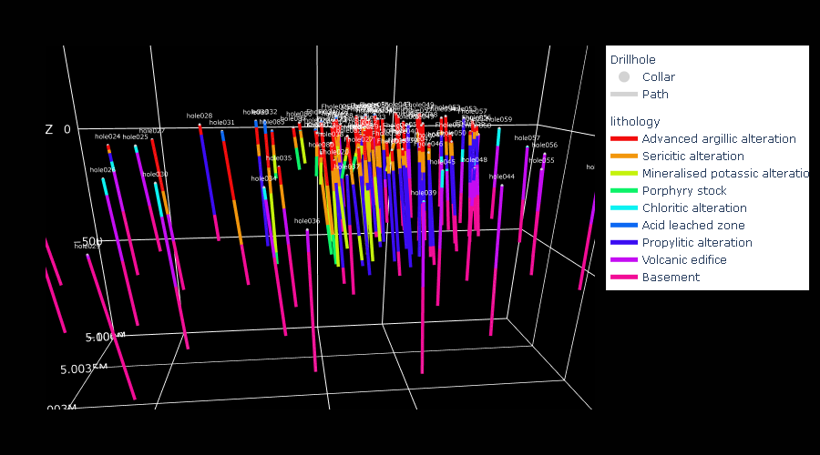
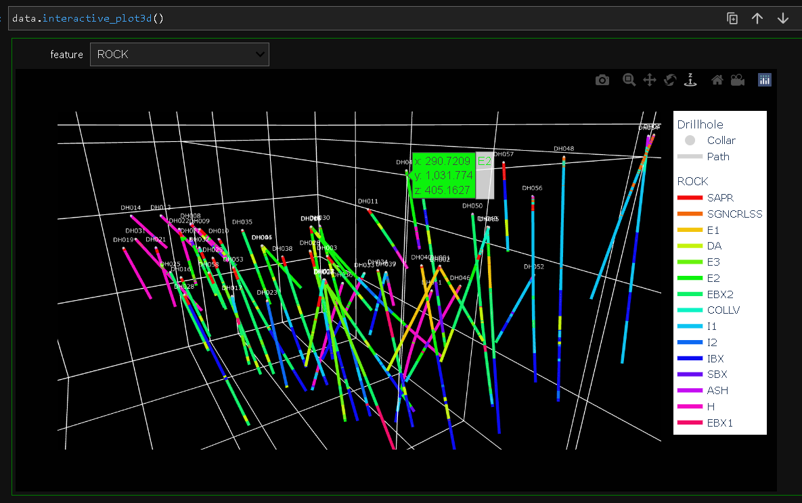

# corelab.py

Python library for 2D and 3D drillhole information visualization\
Note: data cleaning and validation is recommended before using this library\
Requires: numpy, pandas, numba, ipywidgets, scipy, tqdm, plotly

Copyright 2023, kevinalexandr19\
This software may be modified and distributed under the terms of the MIT license.\
See the LICENSE file for details.

